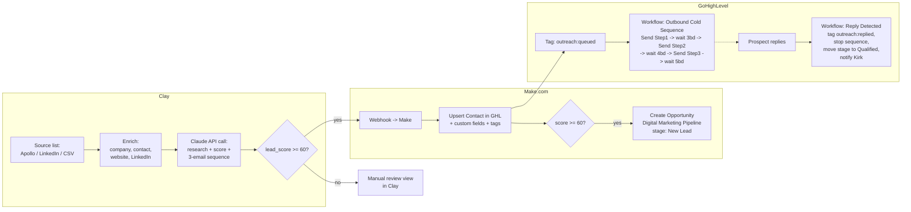

# Architecture — Autonomous Lead Outreach

## Overview

Four systems, each doing the one thing it's actually good at:

- **Clay** — sources and enriches leads, calls Claude to research + draft copy
  per lead, filters out weak fits.
- **Claude** (Anthropic API, called from Clay) — reads the research bundle for
  one prospect and returns a lead score plus a full 3-email sequence and
  LinkedIn note. See `prompts/claude-outreach-system-prompt.md`.
- **Make.com** — thin integration layer. One webhook-triggered scenario:
  receive a qualified lead from Clay, write it into GHL, open an opportunity.
  See `make/`.
- **GoHighLevel** — system of record and send engine. Holds the contact/CRM
  data, sends the actual emails on a multi-day cadence via native workflows,
  detects replies, and stops the sequence. See `docs/ghl-setup.md`.

## Why the sequence timing lives in GHL, not Make

Make scenarios that hold state across multi-day waits are expensive
(operations-metered) and fragile (a scenario re-deploy mid-wait can orphan
in-flight executions). GHL's workflow engine has native "Wait X business
days" and "Customer Replied" primitives built for exactly this. Make's job
ends the moment the lead is in GHL with the right tag; GHL takes it from
there. This also means Kirk can see and tweak send timing/copy templates
directly in GHL without touching Make at all.

## Why personalization is fully dynamic, not templated

unKAGEd's ICP is owner-operated SMBs, not a high-volume SaaS funnel — reply
rate depends on the email reading as written *for this specific business*,
not as a mail-merge. So GHL's email templates (`docs/ghl-setup.md` §6) are
just merge-field shells; Claude writes the entire subject and body per lead,
Clay stores it in custom fields, and GHL merges it in at send time. This
means the "template" a human sees in GHL's editor is nearly empty — that's
intentional, not a placeholder someone forgot to fill in.

## Data flow / field ownership

| Field | Written by | Read by |
|---|---|---|
| Company/contact firmographics | Clay enrichment | Claude (context), GHL (contact record) |
| `lead_score`, `research_summary`, `personalization_angle`, `pain_point_hypothesis` | Claude | Clay routing filter, GHL contact (for human context) |
| `step1-3_subject/body`, `linkedin_note` | Claude | GHL email templates (merge fields) |
| `outreach:*` tags | Make (initial), GHL workflows (subsequent) | GHL workflow triggers |
| Opportunity stage | Make (initial: New Lead), GHL workflow (on reply: Qualified), human (Proposal Sent onward) | GHL pipeline view |

## Known gaps / follow-ups

- **Make.com MCP access**: blocked this session (see `make/README.md`). Once
  authorized, the HTTP modules in the blueprint can be swapped for the native
  GoHighLevel Make app, and the whole scenario can be provisioned and tested
  live instead of hand-imported.
- **LinkedIn outreach is manual**: no LinkedIn API/automation in this stack
  by design (LinkedIn automation tools carry ToS/ban risk) — the connection
  note is generated for a human to paste.
- **Suppression/dedupe across inbound and outbound**: this location already
  runs an inbound funnel (the "Booking Marketing Pipeline" and existing
  custom fields are inbound-form-driven). `docs/clay-setup.md` §5 flags this
  but a proper two-way suppression sync (don't cold-email someone who already
  submitted an inbound form) is not built yet.
- **Deliverability setup** (SPF/DKIM/DMARC, mailbox warmup, send caps) is
  called out in `docs/ghl-setup.md` §8 but is an operational task, not
  something any of these tools automate.
